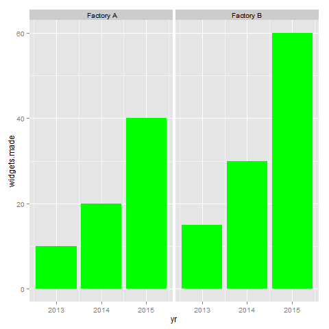

# ggplot_facets

## How do I set a separate fill color for each facet?

This fake data set shows output from two factories.  I want to create a 
`ggplot2` image with two facets, one for each factory.  Currently,
the image looks like this, with just one fill color for both facets:

Instead of having just one color for both facets, I want to set the
fill color for each facet separately:

* red for Factory A
* blue for Factory B

How do I do that?